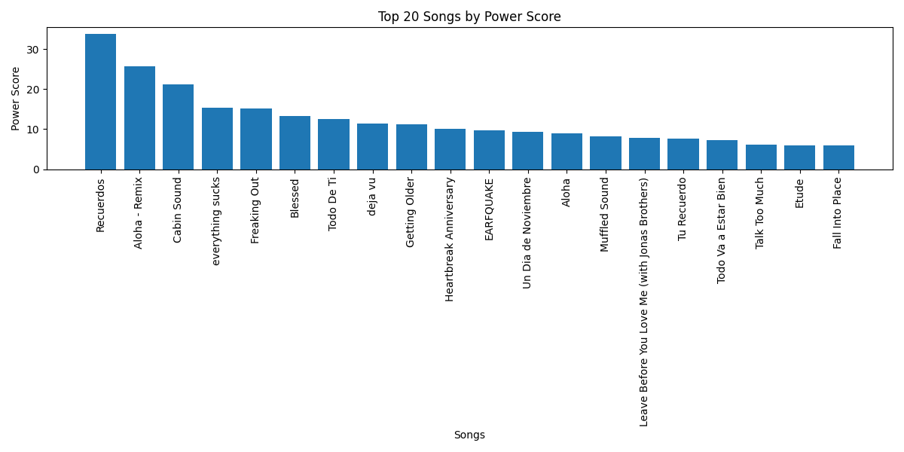
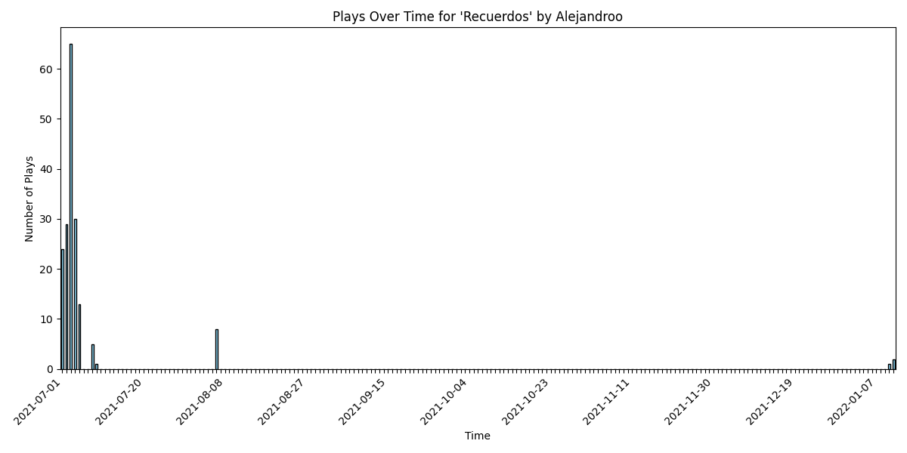
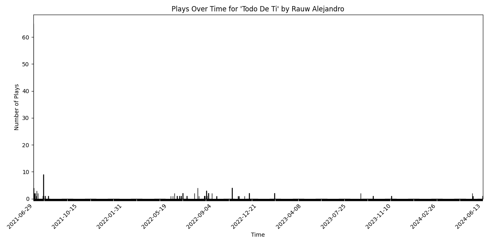

# Spotify Data Exploration

This repository analyzes my Spotify listening history using data exported from Spotify.

## Power Score Analysis

The first graph shows the "power score" of my top songs. The power score is calculated by looking at:
- How frequently a song is played
- The time distribution of plays (clustered plays get higher weight)
- Total timespan the song has been played over
- A decay factor that gives more weight to recent plays

Songs with high power scores tend to be those that I've binged heavily in a short period

## Play Distribution

The bar charts show the play distribution over time for individual songs. These visualizations help identify:
- When I discovered certain songs
- Periods of heavy rotation
- Songs I consistently return to vs one-time binges
- Seasonal listening patterns

The time-based analysis provides interesting insights into how my music tastes and listening habits have evolved over the years.

## Instructions

1. To downlaod your data, go to https://www.spotify.com/us/account/privacy/
2. Make sure to check the checkbox under `Extended Listening History`
3. Click `Request Data`
4. Wait a few days
5. Downlaod data and set up a `.env` file with a variable named `SPOTIFY_DIR=<path_to_dir>`
6. run `python main`
